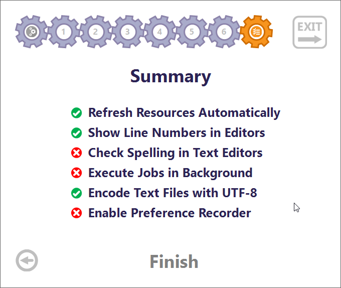

[](https://github.com/rhjoerg/rhjoerg-devenv/actions/workflows/release.yml)

# rhjoerg-devenv
Setup script to install my development environment; targeted for software development under Windows 10.

## Usage

1. Create a folder which will contain your development environment.
2. Download the [Installation Script](https://github.com/rhjoerg/rhjoerg-devenv/releases/download/latest/rhjoerg-devenv.ps1) ("the script") into the folder created in 1.
3. Run the script within the folder created in 1.

## Components

Component | Remarks
--- | ---
Directory structure | See below
JDK 11 | LTS Java SDK used to create Google App Engine Applications
JDK 16 | Current Java SDK used for new software
Ant 1.10.10 | Current Ant release
Maven 3.8.1 | Current Maven release
Eclipse 2021-06 | Current Eclipse IDE (RCP edition), configured to use JDK-16 and workspace within this development environment

## Directory Structure

Directory | Remarks
--- | ---
&lt;root directory&gt; | The directory you run the script in
&emsp;ant | Ant 1.10.10
&emsp;downloads | Download directory
&emsp;eclipse | Eclipse
&emsp;jdk | Directory for JDKs
&emsp;&emsp;jdk-11 | JDK-11
&emsp;&emsp;jdk-16 | JDK-16
&emsp;maven | Maven
&emsp;workspace | Eclipse workspace

# Automatic Eclipse Configuration

The ```eclipse/eclipse.ini``` is replaced with the version available in this project. It sets the Java SDK to use to the JDK-16 installed by the script.

The Ant preferences are set to use the Ant installed by the script.

The additional JDK-11 is added to the "Installed JREs" settings.

# Manual Eclipse Configuration

Click on "Review IDE configuration settings" and configure as shown in the image below:


